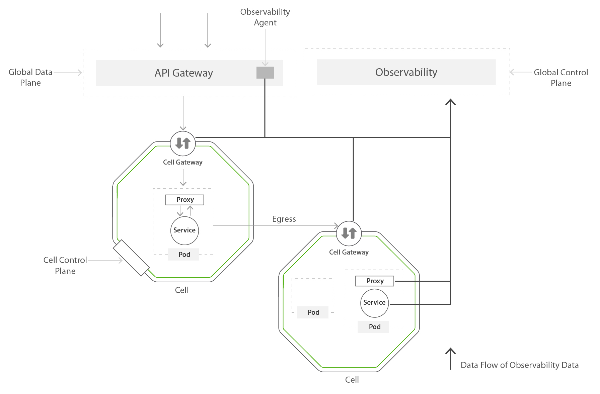

Mesh Observability
==================

  [](https://wso2.org/jenkins/view/cellery/job/cellery/job/mesh-observability/)
  [](https://github.com/wso2-cellery/mesh-observability/releases)
  [](https://github.com/wso2-cellery/mesh-observability/releases)
  [](https://github.com/wso2-cellery/mesh-observability/commits/master)
  [](https://opensource.org/licenses/Apache-2.0)

**Note**: If you just wish to get started with trying out Cellery, you can start your journey at [wso2-cellery/sdk](https://github.com/wso2-cellery/sdk) repository.  

Cellery Observability brings along the capability to observe the Cells deployed on Cellery Mesh. This combines the [Siddhi](https://siddhi-io.github.io/siddhi) Stream Processing Capabilities of [WSO2 Stream Processor](https://wso2.com/analytics-and-stream-processing/) and observability agents deployed along with the Cells to collect and process metrics and tracing data from the Cells.


## High Level Architecture



The observability data such as telemetry and request traces is collected from all the components that participated in the data flow.

* Global Gateway
* Cell Gateway
* Sidecars (Envoy)
* Components of Cells (E.g: Microservices) 

All collected data will be processed by WSO2 Stream processor, and will be stored in the database to show the historical information. By default, the Cellery Mesh is deployed with MySQL database, and hence the telemetry data is also stored in the same database server. 

The Observability Portal can depict the below information. It will show the current status of the mesh, and also the historical view by selecting the preferred time range.

* Distributed Tracing (Request based latency analysis by each component)
  * Timeline view
  * Sequence diagram view
  * Request flow diagram view
* Metrics
  * Application Metrics (Success/Failure rate, Request/sec, Response/sec, Response time)
    * Data Plane
      * Cell based metrics
      * Component based metrics
      * Overall Deployment based metrics
  * System Metrics
    * Data Plane & Control Plane
      * CPU, Memory, Disk Consumption.
      * Network Usage
* Runtime Dependency Model
  * Dependency models of cells and components

## Repo Structure

The Mesh Observability Code is structured as shown below.

```
mesh-observability
  ├── components
  │     └── global
  │           ├── core (Core components of Observability)
  │           └── portal (Observability Portal)
  └── docker
        ├── sp (Stream Processor Docker image)
        └── portal (Observability Portal Docker Image)
```

## Contribute to Cellery Mesh Observability

The Cellery Team is pleased to welcome all contributors willing to join with us in our journey.

### Build from Source

#### Prerequisites

To get started with building Cellery Mesh Observability, the following are required.

* Docker
* JDK 1.8+
* Node & NPM
* Maven
* GNU Make 4.1+

#### Steps to Build

This repository’s build is mainly powered by Apache Maven. Also, a proper build can be triggered through Make.

To get started, first clone the repository and run the following command from the root of the project.

```
make all
```

This will build all the modules in the repository and docker images using the build artifacts. Afterwards, if you wish to push the docker images to the repository, run the following command.

**Note**: You need to login to Docker before running this command.

```
make docker-push
```

If you wish to **customize the build** you can add the following Environment Variables.


| Environment Variable  |                                                  |
|-----------------------|--------------------------------------------------|
| DOCKER_REPO           | The name of the repository of the Docker images  |
| DOCKER_IMAGE_TAG      | The tag of the Docker images                     |

### Issue Management

Cellery Mesh Observability issue management is mainly handled through GitHub Issues. Please feel free to open an issue about any question, bug report or feature request that you have in mind. (If you are unclear about where your issue should belong to, you can create it in [Cellery SDK](https://github.com/wso2-cellery/sdk).)

We also welcome any external contributors who are willing to contribute. You can join a conversation in any existing issue and even send PRs to contribute. However, we suggest to start by joining into the conversations and learning about Cellery Mesh Observability as the first step.

Each issue we track has a variety of metadata which you can select with labels:

* **Type**: This represents the kind of the reported issues such as Bug, New Feature, Improvement, etc. 
* **Priority**: This represents the importance of the issue, and it can be scaled from High to Normal.
* **Severity**: This represents the impact of the issue in your current system. If the issue is blocking your system, and it’s having an catastrophic effect, then you can mark is ‘Blocker’. The ‘Blocker’ issues are given high priority as well when we are resolving the issues.

Apart from the information provided above, the issue template added to the repository will guide you to describe the issue in detail so that we can analyze and work on the resolution towards it. We would appreciate if you could fill most of the fields as possible when you are creating the issue. We will evaluate issues based on the provided details and labels, and will allocate them to the Milestones.
